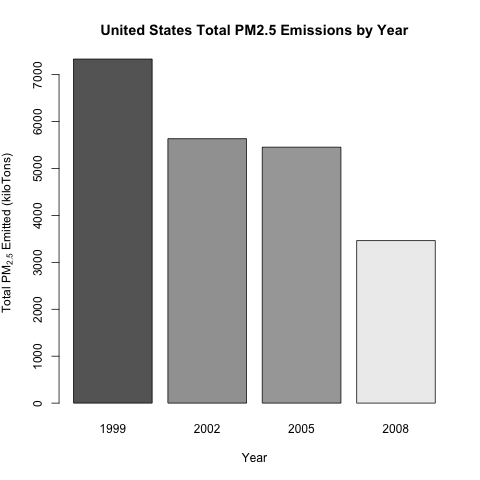
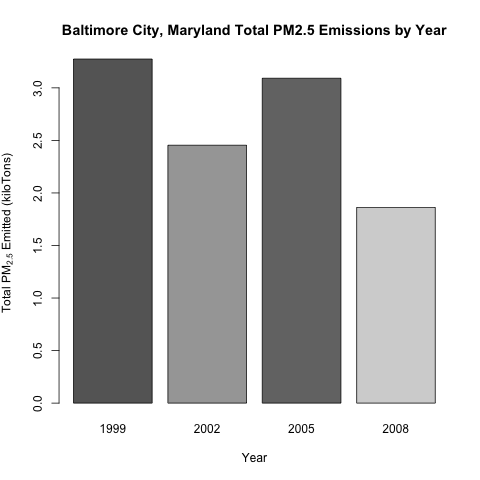
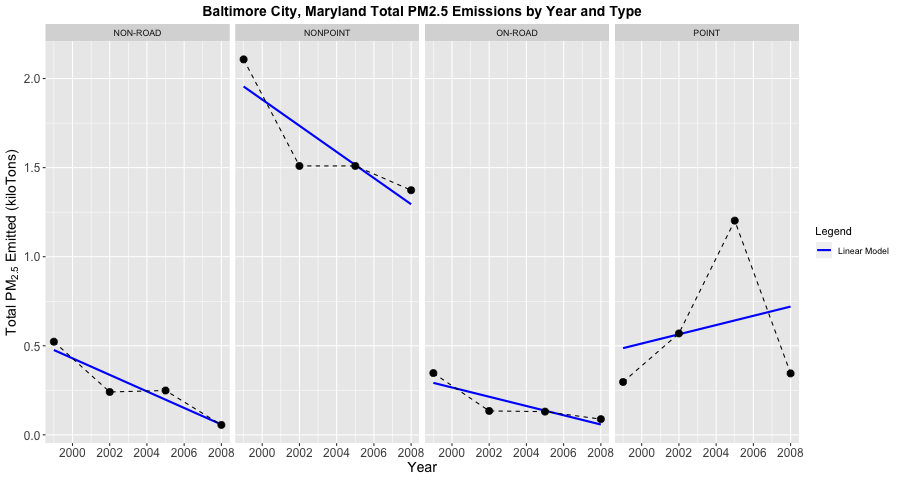
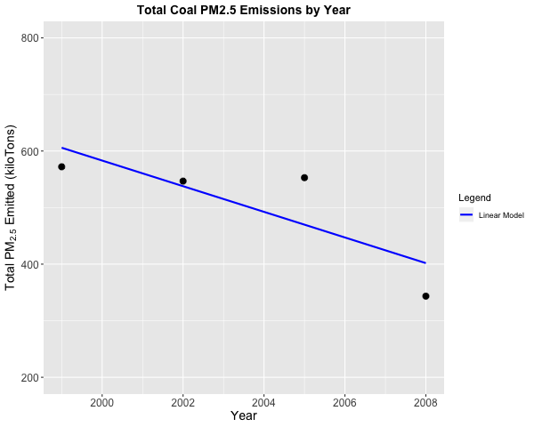
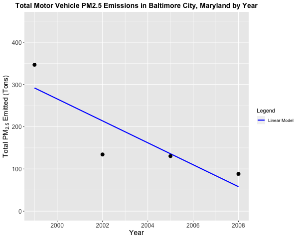
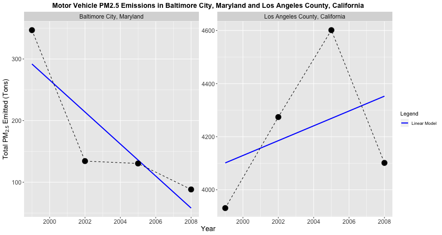

# Exploratory Data Analysis Course Project 2
Peer-graded Project #2 for the course "Exploratory Data Analysis" as part of the Johns Hopkins University / Coursera Data Science Specialization

## Disclaimer
This repo is my own personal inventory of work for the Coursera course Getting and Cleaning Data offered by Johns Hopkins University. I have not and will not share these scripts with anyone who is taking or will take the course.

If anyone comes across these scripts independently, they should only use them in accordance with the Coursera Honor Code
(https://learner.coursera.help/hc/en-us/articles/209818863-Coursera-Honor-Code)

## Question 1
Based on the plot below, it is clear that PM2.5 levels have decreased in the United States from 1999 to 2008. The plot was generated using the base plotting system.

## Question 2
Based on the plot below, it is clear that PM2.5 levels have decreased in Baltimore, MD from 1999 to 2008. The plot was generated using the base plotting system.

## Question 3
Based on the plot below, Point-type PM2.5 levels have increase in Baltimore, MD from 1999 to 2008 whereas Non-Road, Non-Point, and On-Road PM2.5 level have all decreased. The plot was generated using ggplot2.

## Question 4
Based on the plot below, coal combustion-related PM2.5 levels have decreased in the United States from 1999-2008. The plot was generated using ggplot2.

## Question 5
Based on the plot below, motor vehicle-related PM2.5 levels have decreased in Baltimore, MD from 1999-2008. The plot was generated using ggplot2.

## Question 6
Based on the plot below, motor vehicle-related PM2.5 levels have increased in Los Angelese County, CA from 1999-2008, though levels in 2008 were lower than in 2002. Compared to Baltimore, MD -- Baltimore has the seen the greatest change in PM2.5 levels over time as evidenced by comparing the slopes of the regression lines. The plot was generated using ggplot2.

